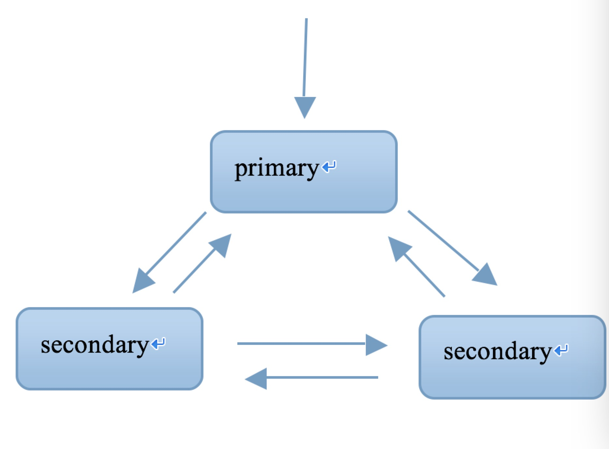

## mongoDB

mongodb 文档数据库,存储的是文档(Bson->json的二进制化)   

存储在硬盘上 以文档为结构  以JSON为基本单位  存储引擎是v8     

文件系统是grid file system   

将json 转为 BSON  binary json   

特点:内部执行引擎为JS解释器, 把文档存储成bson结构,在查询时,转换为JS对象,并可以通过熟悉的js语法来操作.

- mongo和传统型数据库相比,最大的不同:

		
		统型数据库: 结构化数据, 定好了表结构后,每一行的内容,必是符合表结构的,就是说--列的个数,类型都一样
		
		mongo文档型数据库: 表下的每篇文档,都可以有自己独特的结构(json对象都可以有自己独特的属性和值)
		

- mongodb 安装

		
		1. wget http://fastdl.mongodb.org/linux/mongodb-linux-x86_64-rhel70-4.0.0.tgz  下载
		
		2. tar -zvxf 解压缩
		
		3. 不用编译 本身就是编译后的二进制可执行文件
		
		
		bsondump                 	导出bson结构
		
		mongo                   	mongo的客户端
		
		mongod                 		mongo的服务端
		
		mongodump              		整体数据库导出
		
		mongoexport                 导出易识别的json文档或csv文档
		
		mongos                      路由器 分片时用
		
		mongorestore                数据库整体导入
		
	
	
- 启动mongod服务

		
		./bin/mongod --dbpath /path/to/database --logpath /path/to/log --fork --port 27017
		
		参数解释:
		
		--dbpath 数据存储目录
		
		--logpath 日志存储目录
		
		--port 运行端口(默认27017)
		
		--fork 后台进程运行
		
		sudo ./mongod --dbpath ~/mongo/database --logpath ~/mongo/log/mongodb.log  --port 27017
		
		一定logs目录后一定要添加 mongodb.log
		
		mac下启动mongodb
		
			
			To have launchd start mongodb now and restart at login:
			  
			  brew services start mongodb
			
			
			if you don't want/need a background service you can just run:
			  
			  mongod --config /usr/local/etc/mongod.conf
		
		# ulimit -n 2500    #修改shell所能启用的最大进程数
		# ulimit -u 2500    #修改shell所能打开的最大文件数
		

- mongo 命令

		
		show dbs                     查看当前的数据库
		
		use databaseName             选库
		
		show collections/tables      查看当前库下的collection
		
		如何创建库?
		
			在mysql中,用create database,
		
			而在mongodb中,库是隐式创建,
			
			你可以use 一个不存在的库, 然后在该库下创建collection,即可创建库
		
		显式创建collection
			
			db.createCollection(‘collectionName’)  
		
		隐式创建collection
		
			db.collectionName.insert(document) // collectionName 这个collection是之前不存在
		
		
		删除collection
		
			db.collectionName.drop()
		
		删除database
			
			db.dropDatabase()
		
		
		
		增: insert
		介绍: mongodb存储的是文档,. 文档是json格式的对象.
		
		语法: db.collectionName.isnert(document);
		
		1: 增加单篇文档
		
			db.collectionName.insert({title:’nice day’});
		
		2: 增加单个文档,并指定_id
		
			db.collectionName.insert({_id:8,age:78,name:’lisi’});
			
		3: 增加多个文档
			db.collectionName.insert(
				[
				{time:'friday',study:'mongodb'},
				{_id:9,gender:'male',name:'QQ'}
				]
			);
		
		
		删:remove
		语法: db.collection.remove(查询表达式, 选项);
		选项是指  {justOne:true/false},是否只删一行, 默认为false
		
		注意
		1: 查询表达式依然是个json对象
		2: 查询表达式匹配的行,将被删掉.
		3: 如果不写查询表达式,collections中的所有文档将被删掉.
		
		例1: db.stu.remove({sn:’001’});
		删除stu表中 sn属性值为’001’的文档 
		
		例2: db.stu.remove({gender:’m’,true});
		删除stu表中gender属性为m的文档,只删除1行.
		
		
		
		改  update操作
			改哪几行? --- 查询表达式
			改成什么样? -- 新值 或 赋值表达式
			操作选项 ----- 可选参数
		
		语法: 
			
			db.collection.update(查询表达式,新值,选项);
		
		例:
		db.news.update({name:'QQ'},{name:'MSN'});
		是指选中news表中,name值为QQ的文档,并把其文档值改为{name:’MSN’},
		结果: 文档中的其他列也不见了,改后只有_id和name列了.
		即--新文档直接替换了旧文档,而不是修改
		
		如果是想修改文档的某列,可以用$set关键字
		
			db.collectionName.update(query,{$set:{name:’QQ’}})
		
		修改时的赋值表达式
		
			$set  修改某列的值
			
			$unset 删除某个列
			
			$rename 重命名某个列
			
			$inc 增长某个列
			
			$setOnInsert 当upsert为true时,并且发生了insert操作时,可以补充的字段.
		
		
		Option的作用:
		
			{upsert:true/false,multi:true/false}
			
			Upsert---是指没有匹配的行,则直接插入该行.(和mysql中的replace一样)
		
		例:db.stu.update({name:'wuyong'},{$set:{name:'junshiwuyong'}},{upsert:true});
			
			如果有name=’wuyong’的文档,将被修改
			
			如果没有,将添加此新文档
		
		例:db.news.update({_id:99},{x:123,y:234},{upsert:true});
			
			没有_id=99的文档被修改,因此直接插入该文档
		
		multi: 是指修改多行(即使查询表达式命中多行,默认也只改1行,如果想改多行,可以用此选项)
			
			例:db.news.update({age:21},{$set:{age:22}},{multi:true});
			
			则把news中所有age=21的文档,都修改
		
		
		
		查: find, findOne
			
			语法: db.collection.find(查询表达式,查询的列);
				
				Db.collections.find(表达式,{列1:1,列2:1});
		
		
		例1:db.stu.find()
			
			查询所有文档 所有内容
		
		例2: db.stu.find({},{gendre:1})
			查询所有文档,的gender属性 (_id属性默认总是查出来)
			
		例3: db.stu.find({},{gender:1, _id:0})
			
			查询所有文档的gender属性,且不查询_id属性
		
		例3: db.stu.find({gender:’male’},{name:1,_id:0});
			
			查询所有gender属性值为male的文档中的name属性
		
		
		查询表达式:
		
		1: 最简单的查询表达式
			
			{filed:value} ,是指查询field列的值为value的文档
		
		2: $ne --- != 查询表达式
		
			{field:{$nq:value}}
			
			作用--查filed列的值 不等于 value 的文档
		
		3: $in:[]
			例: db.goods.find({cat_id:{$in:[2,8]}} , {goods_id:1,cat_id:1,goods_name:1,_id:0});
		
		4: $nin --> not in
			
			$nin:[2,3,5]
		
		5: $all
			
			语法: {field:{$all:[v1,v2..]}} 
			
			是指取出 field列是一个数组,且至少包含 v1,v2值
		
		6 $exists 
			
			语法: {field:{$exists:1}}
			
			作用: 查询出含有field字段的文档
		
		7: $nor,
			
			{$nor:[条件1,条件2]}
			
			是指  所有条件都不满足的文档为真返回
		
		8:用正则表达式查询 以”诺基亚”开头的商品
			
			例:db.goods.find({goods_name:/诺基亚.*/},{goods_name:1});
		
		9: 用$where表达式来查询
			
			例: db.goods.find({$where:'this.cat_id != 3 && this.cat_id != 11'});
		
		注意: 用$where查询时, mongodb是把bson结构的二进制数据转换为json结构的对象,
		然后比较对象的属性是否满足表达式.
		
		速度较慢
		
		
		
		
		Update时可用的操作符
			例:
		
			->db.user.insert({name:'lisi',age:12,sex:'male',height:123,area:'haidian'});
		
			
			->db.user.update({name:'lisi'},{$set:{area:'chaoyang'},$unset:{height:1},$inc:{age:1},$rename:{sex:'gender'}});
			
			> db.user.find();
			
			{ "_id" : ObjectId("51fc01c4f5de93e1f2856e33"), "age" : 13, "area" : "chaoyang", "gender" : "male", "name" : "lisi" }
		
		$setOnInsert ->相当于mysql中的列的默认值
		
		
		
	
	
- 游标 cursor 操作  

		
		游标是什么?
		通俗的说,游标不是查询结果,而是查询的返回资源,或者接口.
		通过这个接口,你可以逐条读取.
		就像php中的fopen打开文件,得到一个资源一样, 通过资源,可以一行一行的读文件.
		
		
		声明游标:
		var cursor =  db.collectioName.find(query,projection);
		cursor.hasNext() ,判断游标是否已经取到尽头
		cursor. Next() , 取出游标的下1个单元
		
		用while来循环游标
		> var mycursor = db.bar.find({_id:{$lte:5}})
		> while(mycursor.hasNext()) {
		... printjson(mycursor.next());
		... }
		
		
		例:
		// 声明游标
		var cursor = db.goods.find();
		// 循环游标
		for(var doc=true;cursor.hasNext();) { printjson(cursor.next());}
		
		也可以简写:
		for(var  cursor=db.goods.find(), doc=true;cursor.hasNext();) { printjson(cursor.next());}
		
		
		游标还有一个迭代函数,允许我们自定义回调函数来逐个处理每个单元.
		cursor.forEach(回调函数);
		例:
		> var gettitle = function(obj) {print(obj.goods_name)}
		> var cursor = db.goods.find();
		> cursor.forEach(gettitle);
		
		
		游标在分页中的应用
		比如查到10000行,跳过100页,取10行.
		一般地,我们假设每页N行, 当前是page页
		就需要跳过前 (page-1)*N 行, 再取N行, 在mysql中, limit offset,N来实现
		在mongo中,用skip(), limit()函数来实现的
		
		如 var mycursor = db.bar.find().skip(9995);
		则是查询结果中,跳过前9995行
		
		查询第901页,每页10条
		则是 var mytcursor = db.bar.find().skip(9000).limit(10);
		
		通过cursor一次性得到所有数据, 并返回数组.
		例:
		>var cursor = db.goods.find();
		> printjson(cursor.toArray());  //看到所有行
		> printjson(cursor.toArray()[2]);  //看到第2行
		
		注意: 不要随意使用toArray()
		原因: 会把所有的行立即以对象形式组织在内存里.
		可以在取出少数几行时,用此功能.
		
		
	
	
- 索引创建

		
		1:索引提高查询速度,降低写入速度,权衡常用的查询字段,不必在太多列上建索引
		在mongodb中,索引可以按字段升序/降序来创建,便于排序
		默认是用btree来组织索引文件,2.4版本以后,也允许建立hash索引.
		
		查看查询计划
		db.find(query).explain();
		"cursor" : "BasicCursor", ----说明没有索引发挥作用
		"nscannedObjects" : 1000 ---理论上要扫描多少行
		cursor" : "BtreeCursor sn_1", 用到的btree索引
		
		
		常用命令:
		查看当前索引状态: db.collection.getIndexes();
		
		创建普通的单列索引:db.collection.ensureIndex({field:1/-1});  1是升续 2是降续
		
		删除单个索引
		db.collection.dropIndex({filed:1/-1});
		
		创建多列索引  db.collection.ensureIndex({field1:1/-1, field2:1/-1});
		
		一下删除所有索引
		db.collection.dropIndexes();
		
		创建子文档索引
		db.collection.ensureIndex({‘filed.subfield’:1/-1});
		
		创建唯一索引:
		db.collection.ensureIndex({filed.subfield:1/-1}, {unique:true});
		
		创建稀疏索引:
		稀疏索引的特点------如果针对field做索引,针对不含field列的文档,将不建立索引.
		与之相对,普通索引,会把该文档的field列的值认为NULL,并建索引.
		适宜于: 小部分文档含有某列时.
		db.collection.ensureIndex({field:1/-1},{sparse:true});
		
		> db.tea.find();
		{ "_id" : ObjectId("5275f99b87437c610023597b"), "email" : "a@163.com" }
		{ "_id" : ObjectId("5275f99e87437c610023597c"), "email" : "b@163.com" }
		{ "_id" : ObjectId("5275f9e887437c610023597e"), "email" : "c@163.com" }
		{ "_id" : ObjectId("5275fa3887437c6100235980") }
		如上内容,最后一行没有email列,
		如果分别加普通索引,和稀疏索引,
		对于最后一行的email分别当成null 和 忽略最后一行来处理.
		根据{email:null}来查询,前者能查到,而稀疏索引查不到最后一行.(2.6存疑)
		
		
		创建哈希索引(2.4后新增的)
		哈希索引速度比普通索引快,但是,无能对范围查询进行优化.
		适宜于---随机性强的散列
		db.collection.ensureIndex({field:’hashed’});
		
		重建索引
		一个表经过很多次修改后,导致表的文件产生空洞,索引文件也如此.
		可以通过索引的重建,减少索引文件碎片,并提高索引的效率.
		类似mysql中的optimize table
		
		db.collection.reIndex()
		
		
	
	
-  Mongodb导出与导入

					
		1: 导入/导出可以操作的是本地的mongodb服务器,也可以是远程的.
		所以,都有如下通用选项:
		-h host   主机
		--port port    端口
		-u username 用户名
		-p passwd   密码
		
		
		2: mongoexport 导出json格式的文件
		问: 导出哪个库,哪张表,哪几列,哪几行?
		
		-d  库名
		-c  表名
		-f  field1,field2...列名
		-q  查询条件
		-o  导出的文件名
		-- csv  导出csv格式(便于和传统数据库交换数据)
		
		例:
		[root@localhost mongodb]# ./bin/mongoexport -d test -c news -o test.json
		connected to: 127.0.0.1
		exported 3 records
		[root@localhost mongodb]# ls
		bin  dump  GNU-AGPL-3.0  README  test.json  THIRD-PARTY-NOTICES
		[root@localhost mongodb]# more test.json 
		{ "_id" : { "$oid" : "51fc59c9fecc28d8316cfc03" }, "title" : "aaaa" }
		{ "_id" : { "$oid" : "51fcaa3c5eed52c903a91837" }, "title" : "today is sataday" }
		{ "_id" : { "$oid" : "51fcaa445eed52c903a91838" }, "title" : "ok now" }
		
		
		例2: 只导出goods_id,goods_name列
		./bin/mongoexport -d test -c goods -f goods_id,goods_name -o goods.json
		
		例3: 只导出价格低于1000元的行
		./bin/mongoexport -d test -c goods -f goods_id,goods_name,shop_price -q ‘{shop_price:{$lt:200}}’ -o goods.json
		
		注: _id列总是导出
		Mongoimport 导入
		
		-d 待导入的数据库
		-c 待导入的表(不存在会自己创建)
		--type  csv/json(默认)
		--file 备份文件路径
		
		例1: 导入json
		./bin/mongoimport -d test -c goods --file ./goodsall.json
		
		例2: 导入csv
		./bin/mongoimport -d test -c goods --type csv -f goods_id,goods_name --file ./goodsall.csv 
		
		./bin/mongoimport -d test -c goods --type csv --headline -f goods_id,goods_name --file ./goodsall.csv 
		
		
		mongodump 导出二进制bson结构的数据及其索引信息
		-d  库名
		-c  表名
		-f  field1,field2...列名
		
		例: 
		mongodum -d test  [-c 表名]  默认是导出到mongo下的dump目录
		
		规律: 
		1:导出的文件放在以database命名的目录下
		2: 每个表导出2个文件,分别是bson结构的数据文件, json的索引信息
		3: 如果不声明表名, 导出所有的表
		
		
		mongorestore 导入二进制文件
		例:
		 ./bin/mongorestore -d test --directoryperdb dump/test/ (mongodump时的备份目录)
		 
		二进制备份,不仅可以备份数据,还可以备份索引, 
		备份数据比较小.
						
					
	
	
	
- mongodb的用户管理

				
		注意:
		A)在mongodb中,有一个admin数据库, 牵涉到服务器配置层面的操作,需要先切换到admin数据.
		即 use admin , -->相当于进入超级用户管理模式.
		
		B)mongo的用户是以数据库为单位来建立的, 每个数据库有自己的管理员.
		
		C) 我们在设置用户时,需要先在admin数据库下建立管理员---这个管理员登陆后,相当于超级管理员.
		
		
		0: 查看用户
		
		
		1: 添加用户
		命令:db.addUser();
		简单参数: db.addUser(用户名,密码,是否只读)
		
		注意: 添加用户后,我们再次退出并登陆,发现依然可以直接读数据库?
		原因: mongodb服务器启动时, 默认不是需要认证的.
		要让用户生效, 需要启动服务器时,就指定 --auth 选项.
		这样, 操作时,就需要认证了.
		
		
		例: 
		1: 添加用户
		> use admin
		> db.addUser(‘sa’,’sa’,false);
		
		2: 认证
		> use test
		> db.auth(用户名,密码);
		
		3: 修改用户密码
		> use test
		> db.changeUserPassword(用户名, 新密码);
		
		3:删除用户
		> use test
		> db.removeUser(用户名);
		
		注: 如果需要给用户添加更多的权限,可以用json结构来传递用户参数
		例:
		> use test
		>db.addUser({user:'guan',pwd:'111111',roles:['readWrite,dbAdmin']});
		
				
	
	
- replication set复制集

		
		replicattion set 多台服务器维护相同的数据副本,提高服务器的可用性
					
	
	

- replication set命令

		
		Replication set 设置全过程
		0:创建目录 
		mkdir -p /data/r0 /data/r1 /data/r2
		
		
		1:启动3个实例,且声明实例属于某复制集
		./bin/mongod --port 27017 --dbpath /data/r0 --smallfiles --replSet rsa --fork --logpath /var/log/mongo17.log
		./bin/mongod --port 27018 --dbpath /data/r1 --smallfiles --replSet rsa --fork --logpath /var/log/mongo18.log
		./bin/mongod --port 27019 --dbpath /data/r2 --smallfiles --replSet rsa --fork --logpath /var/log/mongo19.log
		
		2:配置
		rsconf = {
		    _id:'rsa',
		    members:
		    [
		        {_id:0,
		        host:'192.168.1.201:27017'
		        }
		    ]
		}
		
		
		3: 根据配置做初始化
		rs.initiate(rsconf);
		
		4: 添加节点
		rs.add('192.168.1.201:27018');
		rs.add('192.168.1.201:27019');
		
		
		5:查看状态
		rs.status();
		
		
		
		6:删除节点
		rs.remove('192.168.1.201:27019');
		
		7:主节点插入数据
		>use test
		>db.user.insert({uid:1,name:'lily'});
		
		8:连接secondary查询同步情况
		./bin/mongo --port 27019
		>use test
		>show tables
		
		rsa:SECONDARY> show tables;
		Sat Aug 17 16:03:55.786 JavaScript execution failed: error: { "$err" : "not master and slaveOk=false", "code" : 13435 } 
		
		8.1 出现上述错误,是因为slave默认不许读写
		>rs.slaveOk();
		>show tables
		
		#看到与primary 一致的数据
		
	
	
- 分片

			
		1:在3台独立服务器上,分别运行 27017,27018,27019实例, 互为副本集,形成3套repl set
		2: 在3台服务器上,各配置config server, 运行27020端口上
		
		3: 配置mongos
		./bin/mongos --port 30000 \
		 --dbconfig 192.168.1.201:27020,192.168.1.202:27020,192.168.1.203:27020
		 
		4:连接路由器
		./bin/mongo --port 30000
		
		5: 添加repl set为片
		>sh.addShard(‘192.168.1.201:27017’);
		>sh.addShard(‘192.168.1.203:27017’);
		>sh.addShard(‘192.168.1.203:27017’);
		
		
		6: 添加待分片的库
		>sh.enableSharding(databaseName);
		
		7: 添加待分片的表
		>sh.shardCollection(‘dbName.collectionName’,{field:1});
		
		Field是collection的一个字段,系统将会利用filed的值,来计算应该分到哪一个片上.
		这个filed叫”片键”, shard key
		
		
		mongodb不是从单篇文档的级别,绝对平均的散落在各个片上, 
		
		而是N篇文档,形成一个块"chunk",
		优先放在某个片上, 
		当这片上的chunk,比另一个片的chunk,区别比较大时, (>=3) ,会把本片上的chunk,移到另一个片上, 以chunk为单位,
		维护片之间的数据均衡
		
		问: 为什么插入了10万条数据,才2个chunk?
		答: 说明chunk比较大(默认是64M)
		在config数据库中,修改chunksize的值.
		
		问: 既然优先往某个片上插入,当chunk失衡时,再移动chunk,
		自然,随着数据的增多,shard的实例之间,有chunk来回移动的现象,这将带来什么问题?
		答: 服务器之间IO的增加, 
		
		接上问: 能否我定义一个规则, 某N条数据形成1个块,预告分配M个chunk,
		M个chunk预告分配在不同片上. 
		以后的数据直接入各自预分配好的chunk,不再来回移动?
		
		答: 能, 手动预先分片!
		
		以shop.user表为例
		1: sh.shardCollection(‘shop.user’,{userid:1}); //user表用userid做shard key
		
		2: for(var i=1;i<=40;i++) { sh.splitAt('shop.user',{userid:i*1000}) } // 预先在1K 2K...40K这样的界限切好chunk(虽然chunk是空的), 这些chunk将会均匀移动到各片上.
		
		3: 通过mongos添加user数据. 数据会添加到预先分配好的chunk上, chunk就不会来回移动了.
		
		
		
			
	